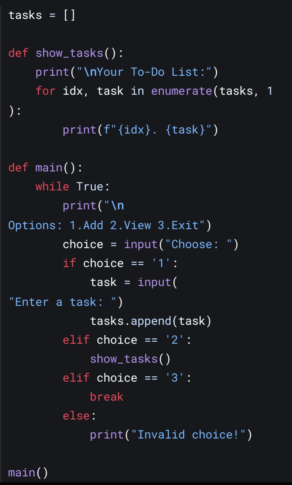

# ✅ CodSoft Internship – Task 1

## 📌 Task Overview

- **Task Title**: To-Do List Application (Python)  
- **Domain**: Python Development  
- **Objective**: Build a simple and functional To-Do List application using Python that allows users to add, view, update, and delete tasks from a list.

---

## 🛠️ Features

- ✅ Add new tasks  
- 📋 View all tasks  
- ✏️ Edit/update existing tasks  
- ❌ Delete a specific task  
- 💾 Save tasks to a file  
- 📂 Load tasks from a file (if implemented)

---

## 🖥️ Technologies Used

- Python (Standard Library)  
- Optional: `tkinter` for GUI or CLI-based interaction

---

## 📸 Screenshots

> *(Add screenshots here if available)*  
>   
> 

---

## 📂 Project Structure
